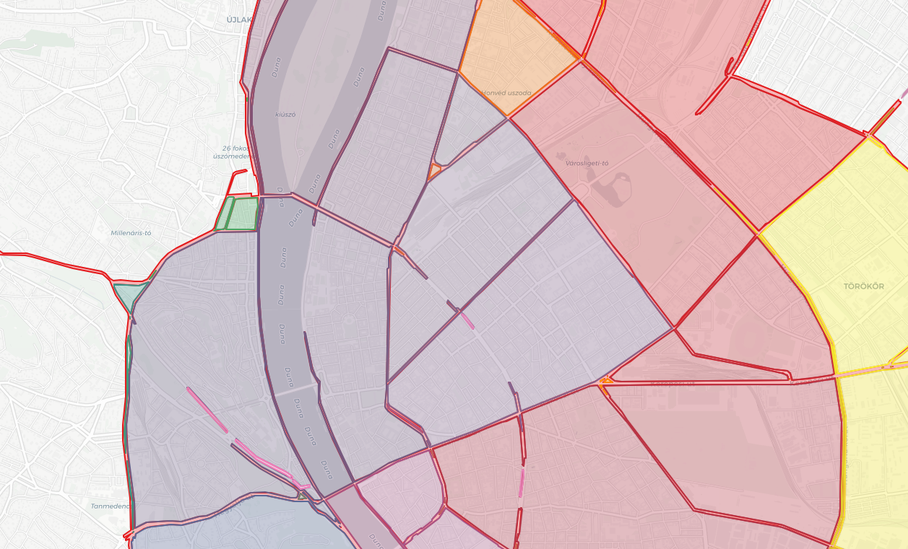

# Superblocks for Budapest

## Introduction

Superblocks are an urban planning approach designed to improve the liveability, sustainability, and safety of cities. This concept involves creating areas bounded by arterial roads, with the local road network within the block serving only local needs. Superblocks reduce through traffic, enabling the redesign and alternative use of streets for pedestrians, cyclists, and public spaces. They also help reduce congestion and emissions while offering opportunities to adapt cities to climate change.

This project explores the potential for implementing superblocks in Budapest, a city with a rich blend of history and modernity. By leveraging data analysis, road capacity evaluations, and traffic simulations, this project aims to provide actionable insights into the feasibility and impacts of superblocks in Budapest.

## Objectives

The main objectives of this project are:

1. To analyze current traffic patterns, road capacities, and congestion levels in Budapest.
2. To identify potential areas for implementing superblocks using boundary roads with high capacity and internal roads optimized for local traffic.
3. To evaluate the potential benefits and trade-offs of superblocks in Budapest, including their impacts on traffic, emissions, and urban accessibility.
4. To develop clear recommendations for policymakers and urban planners regarding the feasibility, advantages, and challenges of superblock implementation in Budapest.

## Methodology

The project involves the following steps:

1. **Data Collection and Preprocessing**:
   - Gather road network data from OpenStreetMap (OSM) and validate it for accuracy.
   - Incorporate road attributes such as the number of lanes, speed limits, and classifications to estimate road capacities.
   - Integrate external traffic data if available to enhance analysis accuracy.

2. **Superblock Identification**:
   - Classify roads into boundary and internal streets based on capacity, type, and traffic patterns.
   - Use high-capacity roads to form non-overlapping superblock boundaries while ensuring internal streets prioritize local access.

3. **Traffic Simulation and Modeling**:
   - Simulate the impacts of superblock designs on traffic flow, congestion, and emissions.
   - Analyze how superblocks influence accessibility and alternative transportation modes.

4. **Recommendations and Reporting**:
   - Summarize findings and propose recommendations for superblock implementation.
   - Disseminate results through visualizations, GeoJSON files, and reports for policymakers and city planners.

## Key Enhancements in Superblock Calculation

1. **Integration of Road Capacities**:
   - Road capacity estimates were calculated using the Michigan Model, incorporating attributes such as the number of lanes, lane width, and speed limits.

2. **Dynamic Thresholds for Road Classification**:
   - Streets were classified as boundary or internal based on their capacity and type, with boundary streets forming the high-capacity perimeters of superblocks.

3. **Validation and Visualization**:
   - Superblocks were validated to ensure non-overlapping boundaries, alignment with major roads, and comprehensive coverage of the city.

4. **Interactive Outputs**:
   - GeoJSON files and interactive maps were created to visualize the results and validate the identified superblocks.

## Updated Visualization

The new image illustrates the identified superblocks in Budapest, highlighting their boundaries and internal road structures:



This map demonstrates:
- **Boundary Streets**: High-capacity arterial roads forming superblock perimeters (highlighted in red).
- **Internal Streets**: Local roads optimized for reduced traffic and pedestrian use (highlighted in light colors within superblocks).

## Installation

To get started with this project:

1. Clone the repository and install dependencies:
   ```bash
   git clone https://github.com/your-username/superblocks-budapest.git
   cd superblocks-budapest
   pip install -r requirements.txt
   ```

2. Run the `main.py` script to generate the updated superblock maps:
   ```bash
   python src/main.py
   ```

3. Access the generated outputs in the `outputs/` directory, including:
   - `budapest_superblocks.geojson` (GeoJSON file of superblocks)
   - Interactive HTML maps of streets, blocks, and superblocks

## Results and Current Status

### Results
1. **Total Identified Blocks**: 1692 blocks have been classified and assigned to their respective superblocks.
2. **Boundary Validation**: Superblocks align with major roads, ensuring effective traffic management.
3. **Capacity Integration**: Streets with higher capacities were used to define superblock perimeters, reducing congestion on internal streets.
4. **Interactive Outputs**: Generated visualizations allow for detailed inspection of the superblock designs.

### Current Status
This project is in the advanced development phase, with ongoing efforts to:
- Incorporate real-world traffic volume data to enhance accuracy.
- Optimize superblock boundaries for accessibility and urban connectivity.
- Perform comprehensive simulations to quantify the environmental and social impacts.

## Contributing

We welcome contributions to this project. If you have ideas for improvements or additional analyses, please open an issue or submit a pull request.

## License

This project is licensed under the terms of the [GNU General Public License v3.0](https://www.gnu.org/licenses/gpl-3.0.en.html).
